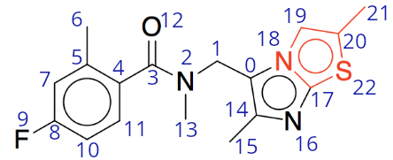
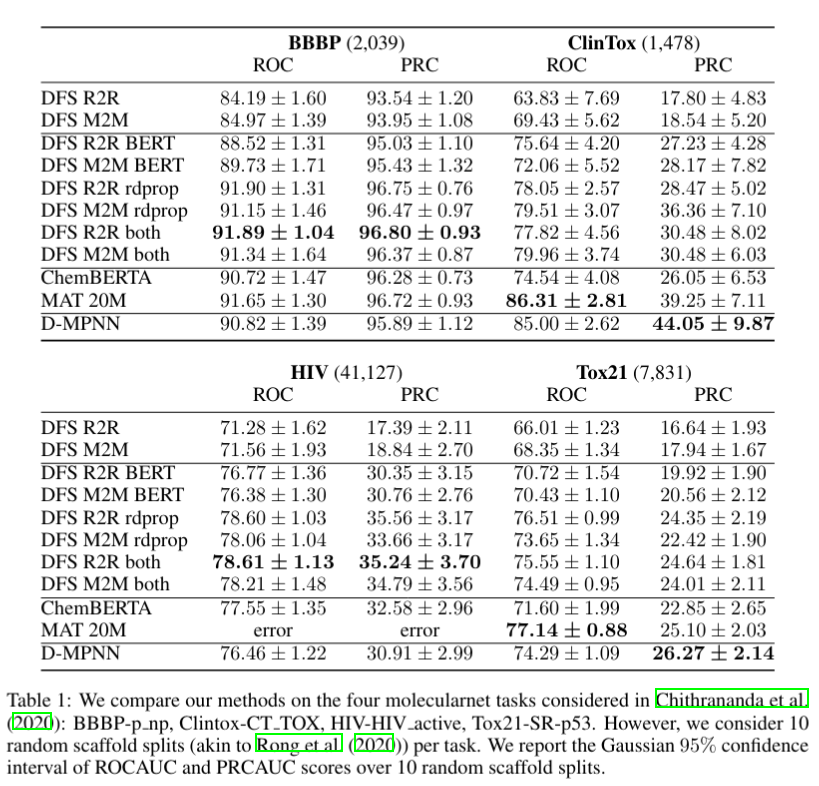
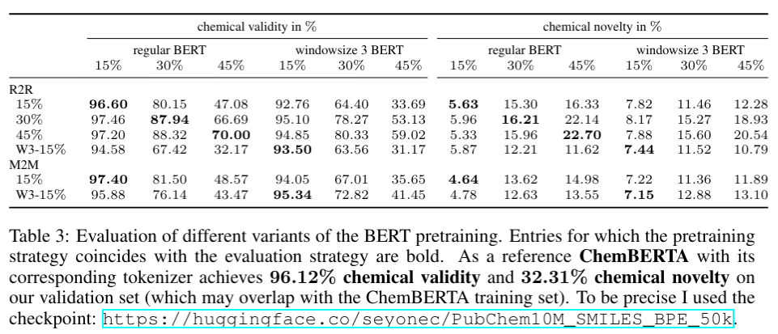
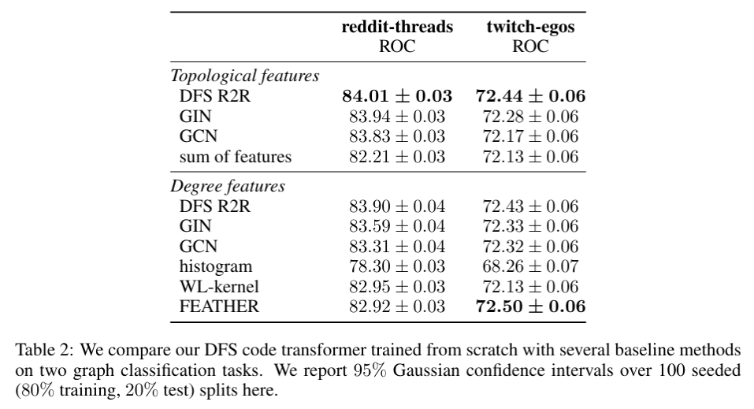

# Foreword

I worked on this project in the scope of my PhD approximately from July 2021 to February 2022 (see commits). At some point I noticed that 
the main idea of this project, i.e., to use DFS codes as a sequence representation of graphs to build novel graph transformers,
was published in the meantime in:

```
@inproceedings{gupta2021graph,
  title={Graph Classification with Minimum DFS Code: Improving Graph Neural Network Expressivity},
  author={Gupta, Jhalak and Khan, Arijit},
  booktitle={2021 IEEE International Conference on Big Data (Big Data)},
  pages={5133--5142},
  year={2021},
  organization={IEEE}
}
```
This reference is probably a good resource to get a better understanding of this project. In contrast to the this reference, here we additionally do selfsupervised pretraining on molecular graphs and classification on other, non-molecular, graph.


# Graph transformers based on depth first search codes

We represent graphs as sequences of edges (so called DFS codes) and process them using transformers. 
DFS codes correspond to depth first search (DFS) traversals of graphs. In particular, they record edges 
in the order in which they are encoundered using DFS. By defining a total order on the space of all such 
sequences it is possible to associate graphs with minimum DFS codes which are unique up to graph isomorphy.
That is, isomorphic graphs have the same minimum DFS codes. 

For example consider the following molecule



where we annotated each atom with its `dfs index`, i.e., the step in which it is visited by DFS. 
Its SMILES representation is `Cc1cc(F)ccc1C(=O)N(C)Cc1c(C)nc2scc(C)n12` and its minimum DFS code is
```
[[ 0,  1,  6,  0,  6], [ 1,  2,  6,  0,  7], [ 2,  3,  7,  0,  6],
 [ 3,  4,  6,  0,  6], [ 4,  5,  6,  2,  6], [ 5,  6,  6,  0,  6],
 [ 5,  7,  6,  2,  6], [ 7,  8,  6,  2,  6], [ 8,  9,  6,  0,  9],
 [ 8, 10,  6,  2,  6], [10, 11,  6,  2,  6], [11,  4,  6,  2,  6],
 [ 3, 12,  6,  1,  8], [ 2, 13,  7,  0,  6], [ 0, 14,  6,  2,  6],
 [14, 15,  6,  0,  6], [14, 16,  6,  2,  7], [16, 17,  7,  2,  6],
 [17, 18,  6,  2,  7], [18,  0,  7,  2,  6], [18, 19,  7,  2,  6],
 [19, 20,  6,  2,  6], [20, 21,  6,  0,  6], [20, 22,  6,  2, 16],
 [22, 17, 16,  2,  6]],
 ```
 in which each 5-tuple is of the form `[dfs index from, dfs index to, atomic number from, bond type, atomic number to]`. 
 In the above example the following atomic numbers: `{'C': 6, 'N': 7, 'O':8, 'F':9, 'N':16}` and the following bond types
 `{'single': 0, 'double': 1, 'aromatic': 2}` occur. The red part of the molecule corresponds to `[18, 19,  7,  2,  6],
 [19, 20,  6,  2,  6], [20, 21,  6,  0,  6], [20, 22,  6,  2, 16],
 [22, 17, 16,  2,  6]]`.

For a formal description of DFS codes have a
look at [./notes/dfs_codes.pdf](./notes/dfs_codes.pdf).

For very symmetrical molecules the computation of the minimal DFS codes can become extremely slow. Thus, we omitted those during preprocessing. 

# Architecture and encoding

We represent DFS codes as dictionaries with one key per component: `'dfs_from', 'dfs_to', 'atm_from', 'atm_to', 'bnd'`.
The corresponding values are tensors containing:
* `'dfs_from'`: sequences of DFS indices of a batch `max_len x batch_size`,
* `'dfs_to'`: sequences of DFS indices of a batch `max_len x batch_size`,
* `'atm_from'`: sequences of atomic numbers and other vertex features of a batch `max_len x batch_size x num_feat_vert`,
* `'atm_to'`: sequences of atomic numbers and other vertex features of a batch `max_len x batch_size x num_feat_vert`,
* `'bnd'`: sequences of bond types and other bond features of a batch `max_len x batch_size x num_feat_edge`.

For the reported results we used pytorch's [TransformerEncoder](https://pytorch.org/docs/stable/generated/torch.nn.TransformerEncoder.html) with 6 [layers](https://pytorch.org/docs/stable/generated/torch.nn.TransformerEncoderLayer.html#torch.nn.TransformerEncoderLayer), with `d_model=600, nhead=12, dim_feedforward=2048, activation='gelu'`. 

We use `d_model=600` because we encode each of the components of the 5-tuples using 120 features. For `'dfs_from'` and `'dfs_to'` we use trigonometric positional encodings. For `'atm_from', 'atm_to'` and `'bnd'` we train a linear encoding layer. The resulting 5 feature vectors per edge are concatenated and mixed using another linear layer.

# Results

## Molecular data

### Moleculenet

We compare the following methods:
* DFS R2R: a DFS code transformer where we represent the molecules using random DFS codes (that is starting the DFS from some random atom and not taking the minimality into account),
* DFS M2M: a DFS code transformer where we represent the molecules using minimum DFS codes,
* DFS R2R BERT: DFS R2R with BERT pretraining,
* DFS M2M BERT: DFS M2M with BERT pretraining, 
* DFS R2R rdprop: DFS R2R where we pretrained by predicting several molecular properties computed with rdkit from the cls token,
* DFS M2M rdprop: DFS M2M where we pretrained by predicting several molecular properties computed with rdkit from the cls token,
* DFS R2R both: DFS R2R where we pretrained using both pretraining strategies,
* DFS M2M both: DFS M2M where we pretrained using both pretraining strategies,
* [ChemBERTA](https://github.com/gmum/huggingmolecules): a smiles transformer,
* [MAT 20M](https://github.com/gmum/huggingmolecules): a graph transformer,
* D-MPNN: a message passing neural network,
on four molecular property prediction tasks from moleculenet.



### Analysis of BERT pretraining

We analyze our DFS code transformers that we have trained using variations of the BERT objective. In particular, we check how many of the 
molecules output by our transformers are valid molecules and how many of the valid ones are novel (i.e., how many got changed by masking and filling back in).



Windowsize 3 (W3) means that when masking we always masked windows of size 3, that is instead of masking only the random
position i, we mask i-1, i and i+1.

## Karateclub

Our DFS code transformer is not limited to molecular graphs. To showcase this, we also evaluated it on two of the karateclub graph classification datasets. Because of the quadratic cost of our attention we limit to the ones with few edges. On top of that we keep only graphs with `<= 200` edges.

We compare the following methods:
* DFS R2R: a DFS code transformer where we represent graphs with random DFS codes,
* [GIN](https://pytorch-geometric.readthedocs.io/en/latest/modules/nn.html#torch_geometric.nn.models.GIN): a graph isomorphism network,
* [GCN](https://pytorch-geometric.readthedocs.io/en/latest/modules/nn.html#torch_geometric.nn.models.GCN): a graph convolutional neural network,
* feature-sum: sum up all the vertex features to get a graph feature vector, 
* histogram: use histogram as graph feature vector,
* [WL-kernel](https://ysig.github.io/GraKeL/0.1a8/generated/grakel.GraphKernel.html#grakel.GraphKernel): use Weisfeiler-Lehman kernel,
* [FEATHER](https://github.com/benedekrozemberczki/FEATHER): use FEATHER method,

once using only the vertex degrees as features and once also using some topological features (number of triangles containing the vertex and eccentricity).

We report ROC-AUC scores. 




# Project structure

### Code structure
```
.
├── config <-- yaml files containing configs for the scripts in ./exp
├── datasets <-- molecular and graph datasets
├── exp <-- scripts for the pretraining and evaluation
├── notebooks <-- some jupyter notebooks
├── notes <-- some notes
├── preprocessed <-- precomputed DFS code representations (you need to download them first see preprocessed/README.md)
├── results <-- scripts for the pretraining and evaluation
├── scripts <-- scripts for preprocessing data and submitting jobs to the cluster (you hopefully won't need that)
└── src <-- nn architectures, dataset classes and trainers

```

# Installation

```bash
poetry install
poetry shell
pip install torch-scatter torch-sparse torch-cluster torch-spline-conv -f https://data.pyg.org/whl/torch-1.12.1+cu102.html
pip install dgl-cu102 -f https://data.dgl.ai/wheels/repo.html

git clone git@github.com:ElizaWszola/dfs-code-representation.git
cd dfs-code-representation
pip install . 
```

Also go to preprocessed README.md and download the preprocessed DFS codes and update the configs in ./config accordingly.

# Baselines
```bash
pip install git+https://github.com/bp-kelley/descriptastorus
pip install chemprop
```

# Example usage

All scripts are parametrized by config files and command line arguments. Please consult the respective files for more details. Scripts for running
experiments are in ./exp and configuration files are in ./config. 

# Molecular data

## Pretraining

For the pretraining to work, make sure to download 
[[pubchem preprocessed]](https://www.icloud.com/iclouddrive/0d7bts2-v_f4d7GvCV03HrV5Q#pubchem)
 and update the config files in ./config/selfattn/data accordingly. 

The parametrization of the training loop in the pretraining script is a bit unconventional. This is because the pretraining dataset with 10 million 
molecules (not provided) does not fit into memory on my machines. I store large datasets by splitting them into several parts of equal size (number of molecules). 
Then in the outer loop that does n_epochs repetitions a subset of the splits is composed into a torch dataset. The inner loop then performs n_iter_per_split 
passes over this dataset and so on. If all splits fit into memory I recommend using n_epochs=1 and n_iter_per_split=<desired_number_of_epochs>, e.g., 
n_iter_per_split=10. If at least es_period (default=1000) batches have been processed the final checkpoint is uploaded as a wandb artifact for later use.
Please make sure to set --wandb_entity, --wandb_project accordingly. --overwrite is used to overwrite parameters that are set via config files.

```bash
python exp/pretrain/selfattn/pubchem_plus_properties.py --wandb_entity dfstransformer --wandb_project pubchem_pretrain --name bert-10K --yaml_data './config/selfattn/data/pubchem10K.yaml' --overwrite '{"training" : {"n_epochs" : 1}, "data" : {"n_iter_per_split" : 10}}'
```

## Evaluation

For the evaluation to work, make sure to download 
[[moleculenet preprocessed]](https://www.icloud.com/iclouddrive/0b5IUU6Yzd4QmU5jt3IrHJQ_Q#mymoleculenet%5Fplus%5Ffeatures)
 and update ./config/selfattn/moleculenet.yaml and ./config/selfattn/finetune_moleculenet.yaml accordingly.

### Pretrained models

[Here](https://wandb.ai/dfstransformer/pubchem_newencoding/artifacts) are some of my pretrained models for molecular data.

### Use pretrained features 

The evaluation script is parametrized by the config file ./config/selfattn/moleculenet.yaml.

```bash
python exp/evaluate/selfattn/moleculenet_plus_properties.py --wandb_entity dfstransformer --wandb_project moleculenet_eval --overwrite '{"pretrained_model":"r2r-30"}'
```

### Finetune

The finetuning script is parametrized by the config file ./config/finetune_moleculenet.yaml. Importantly, this file points to the wandb project containing the pretrained models.
The pretrained model is then selected by setting pretrained_model to the name of the run containing the checkpoint artifact. 

```bash
python exp/evaluate/selfattn/finetune_moleculenet.py --wandb_entity dfstransformer --wandb_project moleculenet_finetune --overwrite '{"pretrained_model":"r2r-30"}'

```

# Karateclub

For this dataset to work, download [[karateclub dataset]](https://www.icloud.com/iclouddrive/09fslwInJA2i6grbE2Dm9e9mw#karateclub) and store it in ./datasets.

DFS codes can be also computed for other, non-molecular, graphs. Here I considered two karateclub datasets: reddit_threads and twitch_egos. Each of these datasets consists of two files
reddit_edges.json and reddit_target.csv, twitch_edges.json and twitch_target.csv respectively. Paths to these files can be supplied via --graph_file which expects a path 
to the json and --label_file which expects a path to the csv. For performance reasons (the DFS code transformer's attention matrix is quadratic in the number of edges), 
we only consider graphs with less or equal 200 edges --max_edges 200. Furthermore, because the computation of minimum DFS codes was very slow for these datasets and the random ones performed quite well on the molecular data we only consider random DFS codes.

## Run torch geometric baselines

Toch geometric models can be supplied via the --model argument. In the file I import torch_geometric.nn as tnn. 
Suitable choices are, e.g., tnn.models.GCN or tnn.models.GIN.

```bash
python exp/evaluate/gnn/karateclub.py --wandb_entity dfstransformer --wandb_project karateclub --model nn.models.GCN
```

For prototyping the --n_samples parameter is useful as it allows to run on a subset of the dataset

```bash
python exp/evaluate/gnn/karateclub.py --wandb_entity dfstransformer --wandb_project karateclub --model nn.models.GIN --n_samples 10000
```

## Run DFS code transformer 

```bash
python exp/evaluate/selfattn/karateclub.py 
```


